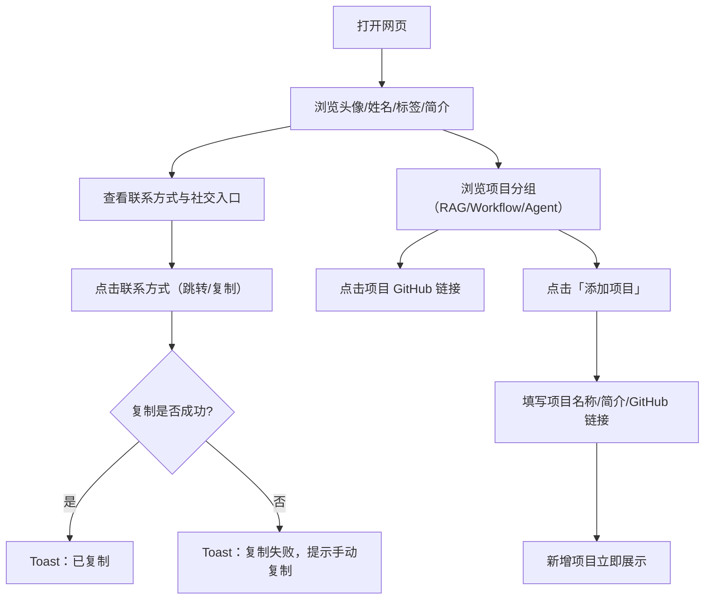

## 1. 产品概述
制作一个轻量、高颜值、苹果式极简高级风的个人名片静态网页，用于在手机与电脑端快速分享与展示个人信息与项目作品集。核心展示“头像 + 姓名 + 职业标签 + 简介 + 联系方式（可跳转/复制）+ 项目分类（RAG/Workflow/Agent）”。

## 2. 核心功能

### 2.1 功能模块
1. **名片主页（单页）**：头像展示（可替换）、姓名、职业/身份标签、简短简介。
2. **联系方式与社交**：邮箱、电话、微信、GitHub、个人主页等信息展示；支持点击直接跳转（mailto/tel/https）与一键复制；展示社交图标入口。
3. **项目作品集**：展示 3 类项目分组：RAG、Workflow、Agent；每类下展示项目列表（项目名称、简短介绍、GitHub 跳转链接）；每类提供“添加项目”按钮，可在前端临时增加项目条目。
4. **交互反馈**：复制成功/失败 toast 提示；键盘可达（Enter/Space）；触控友好点击区。

### 2.2 页面详情
| 页面名称 | 模块名称 | 功能描述 |
|---|---|---|
| 名片主页 | 头像区 | 圆形头像；支持后期替换图片；加载失败时显示占位样式 |
| 名片主页 | 信息区 | 显示姓名、职业/身份标签；层级清晰、重点信息突出 |
| 名片主页 | 简介区 | 简短自我介绍文本区域（可改动文案、长度自适应） |
| 名片主页 | 联系方式区 | 展示邮箱/电话/微信/GitHub/个人主页；支持点击跳转或复制；提供统一的复制反馈提示 |
| 名片主页 | 社交图标区 | 以图标形式呈现 GitHub / 主页 / 邮箱等入口（可配置显示） |
| 名片主页 | 项目区（RAG） | 列出 RAG 项目：名称 + 简介 + GitHub 链接；支持点击跳转；支持“添加项目”新增条目 |
| 名片主页 | 项目区（Workflow） | 列出 Workflow 项目：名称 + 简介 + GitHub 链接；支持点击跳转；支持“添加项目”新增条目 |
| 名片主页 | 项目区（Agent） | 列出 Agent 项目：名称 + 简介 + GitHub 链接；支持点击跳转；支持“添加项目”新增条目 |
| 名片主页 | 交互反馈 | 复制成功/失败 toast；可访问性：按钮可聚焦与键盘触发；提示信息使用 aria-live |

## 3. 核心流程
用户打开网页后浏览信息，可点击联系方式直接跳转或复制对应内容；浏览项目列表并点击 GitHub 打开仓库；需要时在某个分类下点击“添加项目”并填写表单，前端立即渲染新增项目条目。

## 4. 用户界面设计

### 4.1 设计风格
- 整体风格：苹果式极简、高级克制、留白舒适
- 配色：单色系或柔和渐变背景（低饱和度）；少量高质感强调色用于按钮/高亮与链接
- 布局：卡片式布局、圆角、细描边、柔和阴影；背景提供轻微纹理/渐变增强质感
- 字体层级：姓名为主视觉；职业标签与联系方式为次级信息；简介与项目描述为正文阅读层级
- 动效：轻微 hover/press 动效（位移、阴影、光泽）；页面初始进入有淡入与分段上浮；尊重减少动效偏好

### 4.2 页面设计概览
| 页面名称 | 模块名称 | UI元素 |
|---|---|---|
| 名片主页 | 背景层 | 浅色渐变/微纹理；避免强烈对比；提升质感但保持克制 |
| 名片主页 | 卡片容器 | 单卡/双卡布局：个人信息卡 + 项目作品卡；圆角大卡片、精致阴影、细描边；内容分区清晰 |
| 名片主页 | 头像区 | 圆形头像、轻微描边与阴影；支持 hover 微缩放；加载失败占位 |
| 名片主页 | 信息区 | 姓名大字号与较高字重；职业标签采用胶囊形浅底色；关键信息突出 |
| 名片主页 | 简介区 | 2-6 行可读性文本，行高舒适；可随内容增长自适应 |
| 名片主页 | 联系方式区 | 列表化信息（图标+标签+值）；提供主操作（跳转）与次操作（复制）；长内容自动换行/截断策略 |
| 名片主页 | 社交图标区 | 一排图标按钮（GitHub/主页/邮箱等）；hover/press 有细腻反馈 |
| 名片主页 | 项目区 | 分组标题 + 项目卡片列表；每项包含名称、简述、GitHub 链接按钮；分组内“添加项目”按钮 |

### 4.3 响应式
- 桌面优先：卡片宽度随视口自适应，设置最大宽度与边距
- 移动端适配：卡片改为纵向堆叠；更紧凑的内边距与字号缩放；按钮与可点击区域满足触控尺寸
- 无需横向滚动；在极窄屏下保持信息不溢出（换行/省略策略）
