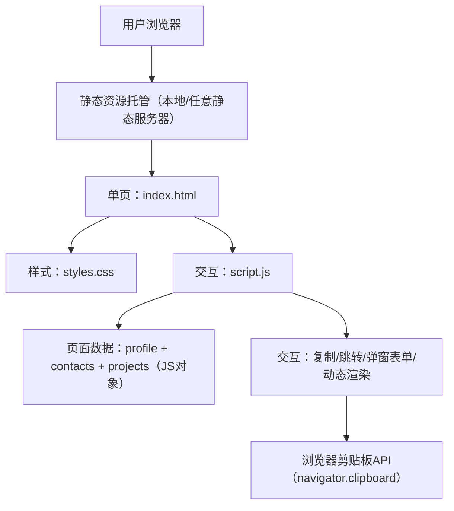

## 1. 架构设计

## 2. 技术说明
- 前端：HTML5 + CSS3 + 原生 JavaScript（ES6）
- 依赖：无第三方框架/无构建工具（纯静态页面）
- 兼容性：主流现代浏览器；剪贴板能力优先使用 `navigator.clipboard.writeText`，并提供降级方案（选中复制提示）
- 交互能力：
  - 联系方式支持 `mailto:` / `tel:` / `https:` 跳转
  - 复制统一走剪贴板能力，并提供 toast 反馈
  - “添加项目”使用原生 `<dialog>`（或等效弹层）收集项目名称/简介/GitHub 链接并动态渲染（不做持久化）
- 性能策略：单页资源少、图片可替换；尽量减少外部请求；SVG 图标内联；快速首屏

## 3. 路由定义
| 路由 | 用途 |
|---|---|
| / 或 /index.html | 个人名片主页 |

## 4. API 定义（无后端）
本项目为纯前端静态页面，不包含后端 API。

## 5. 数据模型（前端内存数据）
页面使用 JavaScript 对象维护展示数据（可在文件中直接修改），并在运行时支持临时新增项目条目（刷新后重置）。

### 5.1 Profile
- name: string
- title: string（职业/身份）
- bio: string（简介）
- avatarUrl: string（头像地址，可替换为本地图片路径）

### 5.2 Contacts
- type: "email" | "phone" | "wechat" | "github" | "homepage" | string
- label: string（展示名称）
- value: string（展示值/可复制值）
- href?: string（点击跳转链接，例如 mailto/tel/https）
- copyable?: boolean（是否显示复制按钮）
- icon?: "mail" | "phone" | "wechat" | "github" | "link" | string（用于选择内联 SVG 图标）

### 5.3 Projects
- groups: RAG / Workflow / Agent
- Project:
  - name: string
  - desc: string
  - github: string（URL）

## 6. 关键交互与状态
- 复制交互：点击任意“复制”按钮写入剪贴板；失败时提示手动复制
- 跳转交互：邮箱/电话/链接支持直接打开（新标签或系统处理）
- 添加项目：按分类打开弹窗表单；提交后插入该分类列表并重新渲染
- 反馈提示：成功/失败 toast（短时自动消失），避免阻塞用户操作
- 可访问性：按钮可聚焦；支持键盘触发；提示信息采用 `aria-live` 让读屏可感知
